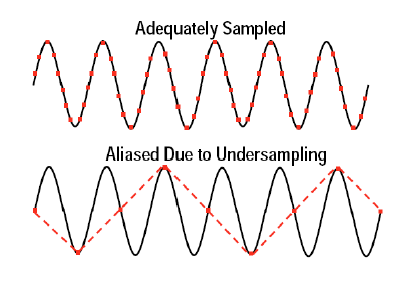
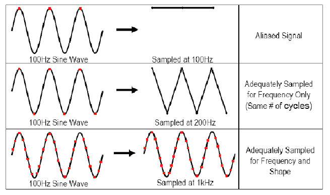

Orale di Laboratorio
======================
***Laboratorio di Meccanica e Termodinamica: domande e risposte plausibili***

**Autore:** *Lorenzo Cazzoli*

# Elenco delle domande

* [Sensori](#sensori)
* [Teorema di Nyquist](#teorema-di-nyquist)
* [Discrepanza](#discrepanza-tra-misure-della-stessa-um)
* [Propagazione delle incertezze (anche binomiale)](#propagazione-delle-incertezze-anche-binomiale)
* [Distribuzioni multivariate](#distribuzioni-multivariate)
* [Covarianza (distribuzione bivariata)](#covarianza-distribuzione-bivariata)
* [Descrivere la probabilità](#descrivere-la-probabilità)
* [Probabilità di somma e intersezione di due eventi](#probabilità-di-somma-e-intersezione-di-due-eventi)
* [Formula di bayes](#formula-di-bayes)
* [Regressione lineare(tutti i casi)](#regressione-lineare-tutti-i-casi)
* [Coefficiente di correlazione lineare](#coefficiente-di-correlazione-lineare)
* [Forma della Gaussiana](#forma-della-gaussiana)
* [Gaussiana con criterio di massima verosimiglianza](#gaussiana-con-criterio-di-massima-verosimiglianza)
* [Errore sulla media e miglior stima (massima verosimiglianza)](#errore-sulla-media-e-miglior-stima-massima-verosimiglianza)
* [Formula della varianza](#formula-della-varianza)
* [Compatibilità tra due misure(+media pesata)](#compatibilità-tra-due-misuremedia-pesata)
* [Distribuzione di student](#distribuzione-di-student)
* [Metodo del rigetto](#metodo-del-rigetto)
* [Distribuzione binomiale (contatori di particelle)](#distribuzione-binomiale-contatori-di-particelle)
* [Distribuzione di poisson](#distribuzione-di-poisson)
* [Poissoniana come limite della binomiale](#poissoniana-come-limite-della-binomiale)
* [Chi quadrato](#chi-quadrato)
* [Random walk](#random-walk)
* [Teorema del limite centrale (+variabili non continue)](#teorema-del-limite-centrale-variabili-non-continue)
* [Fattore di copertura](#fattore-di-copertura)
* [Esperimenti](#esperimenti)

# Sensori

Un `sensore` è un dispositivo capace di restituire una Differenza Di Potenziale in risposta al rilevamento di una grandezza fisica.
Nel tempo genera una curva `Y = f(x)` dove `Y = d.d.p.` e  `x = input`.

Un sensore è caratterizzato da:

$$ Sensibilità: \ f'(x) = \frac{dy}{dx} $$

$$ Accuratezza: \ max|f(x) - f(x)_{standard}| $$

### Catena di misura

$$ Sensore \rarr Amplificatore \rarr Digitalizzatore \ (Analog \ to \ Digital \ Converter \ = ADC) \rarr Computer \ e \ software $$

1. [`Sensore`](#sensori): restituisce un responso in d.d.p. in base alla grandezza rilevata
2. [`Amplificazione`](#amplificazione): moltiplica il segnale per il fattore di amplificazione opportuno (f amp)
3. [`Digitalizzatore ADC`](#digitalizzazione): converte il segnale amplificato in un segnale digitale
4. [`Computer + Software`](#portata): riceve il segnale e lo elabora

#### Amplificazione
Il DAQ (Amplificazione + Digitalizzazione) permette di selezionare un valore di amplificazione f amp, applicato prima della digitalizzazione.

#### Digitalizzazione
L'`ADC` trasforma il segnale da d.d.p. in binario.
L'`ADC` è caratterizzato dal numero di bit assegnati alla conversione di ciascun segnale ricevuto.
Un `ADC` a `x bit` divide il segnale in $2^{x}$ livelli.

#### Portata
La portata è il range di valori accettati a seguito dell'elaborazione del segnale da parte dell'`ADC`.
È caratterizzata da un valore `ADC min` ed uno `ADC max`.
Il fattore di amplificazione è calibrato in modo tale da poter leggere entro i valori della portata quelli riportati dal sensore, secondo la formula:

$$ f_{amp} * Y_{min} > ADC_{min} $$

$$ f_{amp} * Y_{max} \leq ADC_{max} $$

Ricordando che `Y = f(x)` è il valore di d.d.p. riportato dal sensore e $f_{amp}$ il fattore di amplificazione

# Teorema di Nyquist

Data una funzione periodica `s(t)` caratterizzata da una frequenza `fm`, il teorema di Nyquist ci dice che:

$$ Per \ ottenere \ informazioni \ sulla \ frequenza \ fm \ la \ frequenza \ di \ campionamento \ dev'essere \ due \ volte \ fm $$

$$ Per \ ottenere \ informazioni \ sulla \ forma \ di \ s(t) \ la \ frequenza \ di \ campionamento \ dev'essere \ dalle \ cinque \ alle \ dieci \ volte \ fm $$

Immagine sopra:
Sopra: campionamento con frequenza adeguatamente impostata (notare che i punti rossi sono i campionamenti fatti ogni dt)
Sotto: campionamento con frequenza insufficiente. Sia la frequenza della funzione che la sua forma non sono deducibili dai dati ottenuti.

Immagine sopra:
Esempi di effetti di aliasing.

# Confronto tra misure della stessa u.m.

Date due misure dello stesso valore, la discrepanza è la differenza tra di esse.
Date due misure, `X` ed `Y`, con relativi errori $\sigma_{x}$ e $\sigma_{y}$, le misure sono compatibili, ovvero hanno *discrepanza non significativa* se:

$$ max|X+\sigma_{x}, Y+\sigma_{y}| \geq min|X-\sigma_{x}, Y-\sigma_{y}| $$

Lo stesso procedimento può essere applicato anche per misure appurate, o per misure il cui sigma è ottenuto per propagazione degli errori.

Per uno studio più accurato è possibile effettuare uno studio della probabilità che la differenza dei valori sia compatibile con 0.

Se i due campioni sono gaussiani la differenza dei due è anch'essa distribuita normalmente con larghezza la sigma ottenuta per somma in quadratura.
Il valore a cui applicare lo studio di probabilità è `z`, ottenuto come:

$$ z = \frac{\bar{x_{1}} - \bar{x_{2}}}{\sqrt{S_{\bar{x_{1}}}^2 + S_{\bar{x_{2}}}^2}} $$

Se la probabilità che il valore assoluto di z sia maggiore di quella ottenuta è minore di `5%` sussiste una **discrepanza significativa**, se invece è minore di `1%` sussiste una **discrepanza altamente significativa**.

Per la giustificazione di questo metodo, fare riferimento a [Intervallo e livello di confidenza, ovvero student](#distribuzione-di-student)

# Propagazione delle incertezze (anche binomiale)

## Prime approssimazioni

Per la propagazione delle incertezze si può passare per diverse approssimazioni, nel Taylor spiegate in ordine.
Come prima approssimazione possiamo considerare il valore `Z` ottenuto dalla somma di altri due come appartenente al range [$Z-(\sigma_{x}+\sigma_{y}); Z+(\sigma_{x}+\sigma_{y})$], e perciò l'incertezza come la somma delle incertezze.

$$ Z = X \pm Y ; \ \sigma_{Z} = \sigma_{X} + \sigma_{Y} $$

Mentre per valori `Z` ottenuti per prodotto di altre misure si utilizza l'incertezza relativa, secondo la formula:

$$ Z = X * Y ; \ \frac{\sigma_{Z}}{Z} = \frac{\sigma_{X}}{X} + \frac{\sigma_{Y}}{Y}  $$

Queste formule ci permettono di ricavare una formula per `Z` ottenuta come prodotto di fattori elevati ad un esponente:

$$ Z = c * X^{\alpha} * Y^{\beta} * W^{\gamma} ; \frac{\sigma_{Z}}{Z} = |\alpha|*\frac{\sigma_{X}}{X} + |\beta|*\frac{\sigma_{Y}}{Y} + |\gamma|*\frac{\sigma_{W}}{W} $$

## Somma in quadratura

### Esposizione

Ma le formule di cui sopra sono in fin dei conti approssimazioni per ottenere il valore dell'errore *massimo*, non del più probabile. Per ottenere l'errore più *probabile*, invece, si usa un altro processo, adesso esposto e poi giustificato.

$$ Z = X + Y ; \ \sigma_{Z} = \sqrt{\sigma_{X}^2 + \sigma_{Y}^2} $$

Questa è la **somma in quadratura**, e rappresenta più precisamente l'errore più probabile ottenuto dalla somma di misure.
Perché la somma in quadratura dovrebbe essere più precisamente in grado di rappresentare l'errore più probabile?
Perché, se sia `X` che `Y` sono misure *indipendenti* e dotate di sole incertezze *casuali*, si ha una probabilità del 50% di avere una *sovrastima* di `X` sia associata ad una *sottostima* di `Y`. Nel caso invece le misure di `X` ed `Y` fossero correlate in qualche modo (effettuate con lo stesso strumento, o sono correlate da qualunque tipo di fattore), sarebbe probabile che ad una *sovrastima* di `X` sia associata una *sovrastima* di `Y`, e perciò l'errore sarebbe più simile a quello descritto nel paragrafo precedente.
Di seguito la dimostrazione matematica di quanto appena detto:

### Dimostrazione

La dimostrazione richiede la comprensione della [probabilità](#descrivere-la-probabilità) e della funzione di distribuzione di probabilità standard, la [Gaussiana](#gaussiana-con-criterio-di-massima-verosimiglianza).
Detto cio, suddividiamo il problema in `4` casi distinti:

1. *Grandezza misurata con somma di costante numerica*

$$ q = x + A $$

con A fissato e senza incertezza, ed `x` distribuito normalmente attorno ad un valore vero `X`, con una larghezza $\sigma_{x}$.
La probabilità di ottenere un qualunque valore `x` sarà:

$$ P(x) \propto G_{X,\sigma}(x)dx \ proporzionale \ a \ e^{\frac{-(x-X)^{2}}{2\sigma^2}} $$

$$ q = x + A \rarr x = q - A \rarr e^{\frac{-(q-A-X)^{2}}{2\sigma^2}} = e^{\frac{-(x-(X+A))^{2}}{2\sigma^2}} $$

da cui, per la forma della Gaussiana, essendo $ \sigma_{q} = \sigma_{x} $, l'errore rimane invariato in `q`.

2. *Grandezza misurata moltiplicata per una costante numerica*

$$ q = x*B $$

con B fissato e senza incertezza, ed `x` distribuito normalmente attorno ad un valore vero `X`, con una larghezza $\sigma_{x}$.
Seguendo un processo simile al 1., possiamo dire che la probabilità di ottenere un valore `q` sarà proporzionale a:

$$ P(q) \propto e^{\frac{-(\frac{q}{B}-X)^{2}}{2\sigma^2}} = e^{\frac{-(q-BX)^{2}}{2B^{2}\sigma^2}} $$

ovvero, secondo la forma della Gaussiana, i valori di `q` saranno distribuiti normalmente attorno ad un valore medio `q=B` e con larghezza `B`$*\sigma_{x}$.
Da cui l'incertezza su `q` è `B` volte quella in `x`

3. *Somma di due grandezze misurate*

$$ q = x + y $$

con sia `x` che `y` indipendenti e distribuiti secondo due rispettive distribuzioni normali con medie `X` ed `Y` e larghezze $\sigma_{x}$ e $\sigma_{y}$.
Avremo che le probabilità di ottenere un `x` ed un `y` saranno proporzionali alle seguenti:

$$ P(x) \propto e^{\frac{-(x-X)^{2}}{2\sigma_{x}^2}} $$

$$ P(y) \propto e^{\frac{-(y-Y)^{2}}{2\sigma_{y}^2}} $$

Essendo `x` ed `y` indipendenti la probabilità di ottenere un `x` ed un `y` dati sarà il prodotto delle due probabilità.
Per facilitare la dimostrazione svolgiamo i calcoli con `X` ed `Y` uguali a `0`.

$$ P(x,y) \propto exp(-\frac{1}{2}*(\frac{x^2}{\sigma_{x}^2} + \frac{x^2}{\sigma_{y}^2})) $$

Secondo l'identità qui sotto dimostrata:

$$ \frac{x^2}{A} + \frac{y^2}{B} = \frac{(x+y)^2}{A+B} + \frac{(Bx-Ay)^2}{AB(A+B)} = \frac{(x+y)^2}{A+B}+z^2 $$

(ponendo z^2 al posto del secondo termine). DIMOSTRAZIONE IDENTITÀ:

$$ \frac{x^2}{A} + \frac{y^2}{B} = \frac{Bx^2 + Ay^2}{AB} = \frac{(A+B)B*x^2 + (A+B)A*y^2}{AB(A+B)} = \frac{(AB + B^2)x^2 + (AB + A^2)y^2}{AB(A+B)} = \frac{ABx^2 + B^2x^2 + ABy^2 + A^2y^2 +2ABxy -2ABxy}{AB(A+B)} =  $$

$$ = \frac{AB(x^2+2xy+y^2) + B^2x^2 -2ABxy +A^2y^2}{AB(A+B)} = \frac{AB(x+y)^2 + (Bx - Ay)^2}{AB(A+B)} = \frac{(x+y)^2}{A+B} + \frac{(Bx-Ay)^2}{AB(A+B)} $$

Sostituendo secondo l'identità appena dimostrata la somma di $\frac{x^2}{\sigma_{x}^2} + \frac{y^2}{\sigma_{y}^2}$ otteniamo:

$$ P(x,y) \propto exp(-\frac{(x+y)^2}{2(\sigma_{x}^2+\sigma_{y}^2)} -\frac{z^2}{2}) $$

che però può essere considerata come la probabilità di ottenere valori di `x + y` e `z`, e riscritta come:

$$ P(x+y,z) \propto exp(-\frac{(x+y)^2}{2(\sigma_{x}^2+\sigma_{y}^2)}) exp(-\frac{z^2}{2}) $$

per ottenere una probabilità di `x + y` a prescindere da `z` si integra su `z`:

$$ \int_{-\infty}^{+\infty} P(x+y,z)\ dz = P(x+y)*\sqrt{2\pi}  $$

Da cui i valori di `x+y` sono distribuiti normalmente con larghezza:

$$ \sigma_{x+y} = \sqrt{\sigma_{x}^2 + \sigma_{y}^2} $$

che è la stima dell'errore che avevamo preventivato come somma in quadratura.
Se `X` ed `Y` sono diversi da `0` abbiamo che:

$$ x+y = (x-X)+(y-Y)+(X+Y) $$

i termini `x-X` ed `y-Y` sono centrati in `0` con larghezza $\sigma_{x}$ e $\sigma_{y}$, come ottenuto in 1, perciò la loro somma, come appena dimostrato, è distribuita uniformemente con larghezza $\sigma_{x+y}$ in `0`.
Il termine `X+Y` è un valore fisso senza errore, da per cui, come secondo il punto 1., sposta solamente la media in `X+Y`, senza influire sulla larghezza della distribuzione. Da cui:

$$ q = x + y \ ; \ \sigma_{q} = \sqrt{\sigma_{x}^2 + \sigma_{y}^2} $$

4. *Caso generale*

Supponendo di avere una `q` ottenuta da un `x` ed un `y`, non come semplice somma ma come qualunque tipo di funzione.
Ipotizzando di avere $\sigma_{x}$ e $\sigma_{y}$ sufficientemente piccole da poter fare un'approssimazione lineare della funzione `q`, otteniamo:

$$ q(x,y) \approx q(X,Y) + \frac{\partial{q}}{\partial{x}}(x-X) + \frac{\partial{q}}{\partial{y}}(y-Y)  $$

l'approssimazione può essere detta valida in quanto essendo normalmente distribuiti, `x` ed `y` appaiono significativamente solo se relativamente vicini a `X` o `Y`.
Adesso, analizzando la distribuzione di `q(x,y)`, possiamo osservare che è composta dalla somma di tre termini:
1. `q(X,Y)`, che essendo un valore fissato sposta solamente la media, senza influire sulla larghezza
2. la derivata parziale di `q` (un valore fisso in X), moltiplicata per `(x-X)` ha distribuzione normale attorno allo zero con larghezza pari a "derivata di q in x * $\sigma_{x}$"
3. analoga a 2.
Sommando i tre componenti di `q(x,y)`, come visto nei punti 1.-4. otteniamo una distribuzione normale di centro e larghezza seguenti:

$$ q(X,Y) \ ; \ \sigma_{q} = \sqrt{(\frac{\partial{q}}{\partial{x}}\sigma_{x})^2 + (\frac{\partial{q}}{\partial{y}}\sigma_{y})^2} $$

**Questa sopra è la formula generale per il calcolo della propagazione delle incertezze**

# Distribuzioni multivariate

Funzioni dipendenti da più di una variabile casuale sono dette *multivariate*.
Nel corso di Laboratorio di Meccanica e Termodinamica ci si è concentrati sulle funzioni dipendenti da **due** variabili casuali, dette anche *bivariate*.
Per funzioni bivariate è possibile disporre i dati ottenuti in un grafico bidimensionale, con lungo ogni asse una variabile casuale, detto **scatter plot**, o **grafico di dispersione**, ed estrapolarne un grafico "tridimensionale", più accuratamente un istogramma bidimensionale, detto **LEGO plot**.
Il LEGO plot rappresenta sulla terza dimensione il numero di eventi per ogni coordinata degli altri due assi.
Analogamente per il caso monodimensionale, un istogramma bidimensionale i cui bin tendono ad un numero infinito permette la definizione di una funzione di distribuzione di probabilità (PDF bidimensionale)
Al fine di trattare come indipendenti le due variabili abbiamo però la necessità di uno strumento che ci permetta di quantificare la correlazione tra le due. Questo sarà detto covarianza, e definito nel prossimo paragrafo.

# Covarianza (distribuzione bivariata)

Data una funzione multivariata, `f(x,y)`, dalla formula della propagazione delle incertezze (comunque sarà riportata la dimostrazione a seguito) possiamo ricavare che la [**varianza**](#formula-della-varianza) di `f(x,y)` sarà:

$$ \sigma_{f(x,y)}^2 = (\frac{\partial{q}}{\partial{x}}\sigma_{x})^2 + (\frac{\partial{q}}{\partial{y}}\sigma_{y})^2 + 2(\frac{\partial{q}}{\partial{x}}\frac{\partial{q}}{\partial{y}})\sigma_{xy} $$

Con $\sigma_{xy}$ come valore di **covarianza**, ovvero:

$$ \sigma_{xy} = \frac{1}{N} \sum_{i}(x_{i}-\bar{x})(y_{i}-\bar{y}) $$

Se i valori `x` ed `y` sono indipendenti, per `N` tendenti ad $\infty$, la covarianza tenderà a 0, se **non** sono indipendenti avrà un valore che ci dà informazioni riguardo il tipo di correlazione.
Se $\sigma_{xy} > 0 \rarr x \propto y$, mentre se $\sigma_{xy} < 0 \rarr x \propto y^{-1}$  

## Due possibili dimostrazioni della Covarianza

### Taylor (con la varianza, p.213)
 
$$ Varianza \ = \sigma_{q}^2 = \frac{1}{N} \sum (q_{i}-\bar{q})^2 $$
$$ q_{i} = q(x_{i},y_{i}) \ che \ per \ approssimazione \ lineare \ di \ q \ per \ (x_{i}-\bar{x}) \ piccoli: \ 
q_{i} \approx q(\bar{x}, \bar{y}) + \frac{\partial{q}}{\partial{x}}(x_{i}-\bar{x}) + \frac{\partial{q}}{\partial{y}}(y_{i}-\bar{y}) $$
$$ \bar{q} = \frac{1}{N}\sum_{i}^{N}q_{i}, \ sostituendo \ la \ formula \ sopra: \ \bar{q} = q(\bar{x}, \bar{y}), \ siccome \ gli \ altri \ termini \ si \ annullano. \ (dalla \ def. \ di \ \bar{x} \ segue \ che: \ \sum(x_{i} - \bar{x}) = 0) $$

Sostituendo le ultime due equazioni nella formula della varianza otteniamo che:

$$ \sigma_{q}^2 = \frac{1}{N}\sum[\frac{\partial{q}}{\partial{x}}(x_{i}-\bar{x}) + \frac{\partial{q}}{\partial{y}}(y_{i}-\bar{y}]^2 $$
$$ = (\frac{\partial{q}}{\partial{x}})^2 \frac{1}{N} \sum(x_{i}-\bar{x})^2 + (\frac{\partial{q}}{\partial{y}})^2 \frac{1}{N} \sum(y_{i}-\bar{y})^2 + 2\frac{\partial{q}}{\partial{x}}\frac{\partial{q}}{\partial{y}}\sum(x_{i}-\bar{x})(y_{i}-\bar{y}) $$

Adesso, i primi due termini sono per definizione i valori $\sigma_{x}$ e $\sigma_{y}$, mentre il terzo è proprio il valore della covarianza.

### Con deviazione standard massima

Considerando i risultati ottenuti nella dimostrazione della somma in quadratura, possiamo dire che il valore massimo della deviazione standard sia = alla somma degli errori, ovvero alla somma delle derivate parziali della nostra `q`, ognuna di esse moltiplicata per il valore dell'errore sulla variabile di derivazione:

$$ \sigma_{q} \leq \frac{\partial{q}}{\partial{x}}\sigma_{x} + \frac{\partial{q}}{\partial{y}}\sigma_{y} $$

Non ci rimane che elevare al quadrato per ottenere la varianza:

$$ \sigma_{q}^2 \leq (\frac{\partial{q}}{\partial{x}}\sigma_{x})^2 + (\frac{\partial{q}}{\partial{y}}\sigma_{y})^2 + 2\frac{\partial{q}}{\partial{x}}\frac{\partial{q}}{\partial{y}}\sigma_{x}\sigma_{y} $$

Adesso, per la **Disuguaglianza di Schwartz**, $\sigma_{x}\sigma_{y}$ è proprio il valore massimo di $|\sigma_{xy}|$, se questa è definita come abbiamo detto all'inizio del paragrafo.
Possiamo sostituirla ed abbiamo il nostro risultato, come per la [dimostrazione del Taylor](#taylor-con-la-varianza-p213).

# Coefficiente di correlazione lineare

Il **coefficiente di correlazione lineare**, `r`, è un valore adimensionale compreso tra -1 ed 1, che indica quanto due valori sono correlati da una relazione funzionale (in particolare lineare). 
`r` è definito come:

$$ r = \frac{\sigma_{xy}}{\sigma{x}\sigma_{y}} = \frac{\sum(x_{i}-\bar{x})(y_{i}-\bar{y})}{\sqrt{\sum(x_{i}-\bar{x})^2*\sum(y_{i}-\bar{y})^2}} $$

## dimostrazione del dominio di r

essendo $|\sigma_{xy}| \leq \sigma_{x}\sigma_{y}$ il loro rapporto è al massimo 1 ed al minimo -1.

In alternativa, considerando una `y` ottenuta in funzione di `x` secondo una correlazione lineare possiamo ottenere che `r` sarà = $\pm 1$:

$$ y_{i} = A + Bx_{i} \rarr \bar{y} = A + B\bar{x} $$

$$ r = \frac{\sum(x_{i}-\bar{x})(A+Bx_{i}-A+B\bar{x})}{\sqrt{\sum(x_{i}-\bar{x})^2*\sum(A+Bx_{i}-A+B\bar{x})^2}} = 
\frac{B\sum(x_{i}-\bar{x})^2}{|B|\sqrt{\sum(x_{i}-\bar{x})^2}} = \frac{B}{|B|} = \pm 1 $$

Per decretare la significatività di una correlazione lineare, si può studiare la probabilità che un `r` sia maggiore di `|r|` dato `N`, secondo una distribuzione particolare data dalla formula (non richiesta nell'orale):

$$ P_{N}(|r|>|r_{0}|) = \frac{2\Gamma[(N-1)/2]}{\sqrt{\pi}\Gamma[(N-2)/2]}\int_{|r_{0}|}^{1} (1-r^2)^{(N-4)/2} dr $$

Se la probabilità di `r` maggiori è minore del `5%` la correlazione è **significativa**, se è minore dell'`1%` è **altamente significativa**. 

# Metodo del rigetto

È possibile, in un campione di dati distribuiti normalmente (secondo una distribuzione Gaussiana), rigettare dati altamente improbabili secondo il **Criterio di Chauvenet**, che dice:

> Se il numero atteso di misure improbabili, cioè misure che distano dalla media più di z variazioni standard (con z = (Xsospetta - Xbest)/sigma) è minore di 0.5, la misura può essere rigettata

Per ottenere il numero di misure attese data la probabilità di $z > z_{0}$ moltiplicare tale probabilità per il numero di campioni. 

# Descrivere la probabilità

La probabilità è un concetto relativamente sfuggente, che noi abbiamo definito in tre modi diversi, due pratici ma logicamente imperfetti, uno logicamente solido ma impossibile da mettere in pratica.

1. Rapporto di casi favorevoli e possibili
> Dati r casi favorevoli all'avverarsi dell'evento A ed R casi possibili possiamo definire la probabilità di A come il rapporto dei casi favorevoli e quelli possibili, ovvero r/R, a patto che ogni caso sia equamente probabile.
Questa è una definizione a priori, attuabile solamente se tutti i casi sono equamente probabili, è utile per lo studio di probabilità quali quelle del risultato mostrato da una faccia di un dado.
2. Definizione empirica
> La probabilità che l'evento A si verifichi è uguale al limite per N tendente ad infinito della frequenza di A, ovvero il numero di casi in cui A si verifica (n) sul numero di campionamenti totali (N)
Questa definizione empirica non è logicamente assicurata in quanto niente forza il limite a tendere ad un numero ben definito.
3. Definizione assiomatica
> Si definisce probabilità di un evento casuale A un numero P(A) associato univocamente all'evento stesso che soddisfi tre requisiti:
> 1. P(A) $\leq$ 0 qualunque sia A
> 2. P(S) = 1 con S un evento certo, o l'unione di tutti gli eventi possibili
> 3. P(A1 U A2 U A3 ...) = P(A1) + P(A2) + P(A3) ... se l'intersezione tra gli eventi A1-3 è nulla

# Probabilità di somma e intersezione di due eventi

Dati due eventi A e B, dotati ognuno di una probabilità di verificarsi, dette P(A) e P(B), è possibile calcolare la probabilità che si verifichi una qualunque combinazione degli eventi A e B, secondo le formule di unione ed intersezione.

Di seguito tutte le formule utili al calcolo di probabilità generale:

1. Probabilità $\bar{A}$

$$ P(\bar{A}) = \frac{N-n}{N} = 1- \frac{n}{N} =  1- P(A) $$
2. Probabilità $P(A \cup  B )$

$$ P(A\cup B) = P(A) + P(B) - P(A\cap B) $$
Inoltre possiamo dire che $P(A \cup B) \leq P(A) + P(B) $

3. Probabilità $P(A \cap B) $

$$ P(A\cap B) = P(A|B) P(B) = P(B|A)P(A) $$

Con $P(Y|X)$ la probabilità che avvenga Y dato X

Se A e B sono indipendenti $P(A|B)=P(A)$,  da cui $P(A\cap B) = P(A)P(B) $

Per N eventi $A_{i}$ possiamo generalizzare la fomula come:

$$ P(\cap_{i=1}^{N} A_{i}) = \Pi_{i}^{N} P(A_{i}) $$

# Formula di bayes

$$ Formula \ di \ Bayes:$$

$$ P(Hi|E) = \frac{P(E|Hi)*P(Hi)}{P(E)} $$

$$ Con: P(E)=\sum_{i=0}^{N}{P(E|Hi)*P(Hi)} $$

La formula è ricavata sempicemente, data la definizione di probabilità condizionata ed il teorema della probabilità composta, il tutto portato al caso in cui, essendo presenti più eventi, la combinazione totale sia una sommatoria:

$$ Per \ definizione \ di \ probabilità \ combinata: \ P(Hi|E) = \frac{P(E\cap Hi)}{P(E)} $$ 

$$ Per \ il \ teorema \ della \ probabilità \ composta: \ P(E \cap Hi)=P(E|Hi)*P(Hi) $$

Ora non resta che dire che, se la probabilità complessiva che avvenga E sia la sommatoria di più probabilità, ognuna di esse data dalla probabilità composta di un evento *Hi-esimo*, ed abbiamo ottenuto la Formula di Bayes.

# Regressione lineare (tutti i casi)

Dato un insieme di valori `x` ed `y`, considerati tali che
1. Gli errori su x siano trascurabili
2. Le grandezze $y_{i}$ siano estratte da popolazioini Gaussiane
3. Gli errori sulle y, $\sigma_{y}$, siano tutti uguali
4. Le x e le y siano legate da una correlazione lineare di tipo "$y = A + Bx$"

Quali dovrebbero essere le migliori stime di A e B?
Applicando il [metodo di massima verosomiglianza](#gaussiana-con-criterio-di-massima-verosimiglianza) possiamo ottenere le formule per calcolare A e B, ovvero:

$$ A = \frac{\sum x_{i}^2 \sum y_{i} - \sum x_{i} \sum x_{i} y_{i}}{\Delta} = ordinata \ all'origine$$

$$ B = \frac{N\sum x_{i}y_{i} - \sum x_{i} \sum y_{i}}{\Delta} =\ coefficiente \ angolare$$

$$ \Delta = N\sum x_{i}^2 -(\sum x_{i})^2 $$

Inoltre otteniamo che le incertezze su A e B sono pari a:

$$ \sigma_{A} = \sigma_{y}\sqrt{\frac{\sum x_{i}^2}{\Delta}} \ \ \ ; \ \ \  \sigma_{B} = \sigma_{y}\sqrt{\frac{N}{\Delta}} $$

Se $\sigma_{y}$ è ignota può essere stimata come:

$$ \sigma_{y} = \sqrt{\frac{1}{N-2}\sum_{i}^{N} (y_{i}-A-Bx_{i})^2} $$

Se i valori di $\sigma_{y}$ variano, è possibile ottenere i risultati di A, B ed i loro errori semplicemente aggiungendo il peso $w_{i}$ ad ogni i-esimo elemento delle sommatorie.

$$ w_{i} = \frac{1}{\sigma_{y_{i}}^2} \ \ da \ cui \ \ \sum x_{i} \rarr \sum w_{i} x_{i}, \ \ \sum x_{i}y_{i} \rarr \sum w_{i}x_{i}y_{i}  $$

$$ ed \ in \ particolare \ \Delta = \sum w_{i}\sum w_{i}x_{i}^2 -(\sum w_{i}x_{i})^2 $$

## Dimostrazione del risultato

Al fine di ottenere A e B, dobbiamo considerare che le y sono distribuite normalmente, quindi secondo una distribuzione Gaussiana. Le A e B che meglio si approssimano ai nostri dati sono quelle che massimizzano la probabilità di ottenere risultati come quelli del campione ottenuto, e perciò che minimizzano il quadrato all'esponente della formula della Gaussiana. Tale metodo è anche detto dei minimi quadrati.

Se chiamiamo $y_{i} = A + Bx_{i}$ il valore vero della misura i-esima delle y, la probabilità di ottenere il valore misurato $y_{i}$ sarà:

$$ P_{A,B}(y_{i}) \propto \frac{1}{\sigma_{y}} e^{-(y_{i}-A-Bx_{i})^2/2\sigma_{y}^2} $$

Da cui la probabilità di ottenere le N misure $y_{1},...,y_{N} $ sarà:

$$ P_{A,B}(y_{i},...,y_{n})=P_{A,B}(y_{1})*P_{A,B}(y_{2})*...*P_{A,B}(y_{N}), \ \ perciò: $$

$$ P_{A,B}(y_{i},...,y_{n}) \propto \frac{1}{\sigma_{y}^N} e^{-\chi^2/2}, \ \ dato: $$

$$ \chi^2 = \sum_{1}^{N} \frac{(y_{i}-A-Bx_{i})^2}{\sigma_{y}^2} $$

Per ottenere la massima probabilità dell'evento dovremo minimizzare la somma dei quadrati ($\chi^2$), perciò differenziamo $\chi^2$ per A e B e poniamo le derivate =0.

$$ \frac{\partial{\chi^2}}{\partial{A}} = \frac{-2}{\sigma_{y}^2}\sum(y_{i}-A-Bx_{i}) = 0 $$

$$ \frac{\partial{\chi^2}}{\partial{B}} = \frac{-2}{\sigma_{y}^2}\sum x_{i}(y_{i}-A-Bx_{i}) = 0 $$

Separando gli elementi della parentesi per ottenere più sommatorie facilmente gestibili otteniamo due equazioni in A e B, da cui ricavarne i valori ($\Delta$ è posto per abbreviare le formule singole):

$$ AN + B\sum x_{i} = \sum y_{i} \rarr A = \frac{\sum x_{i}^2 \sum y_{i} - \sum x_{i} \sum x_{i} y_{i}}{\Delta}$$

$$ A \sum x_{i} + B \sum x_{i}^2 = \sum x_{i}y_{i} \rarr B = \frac{N\sum x_{i}y_{i} - \sum x_{i} \sum y_{i}}{\Delta} $$

Gli errori in A e B sono ottenuti per [propagazione degli errori](#propagazione-delle-incertezze-anche-binomiale) secondo `y`.

Lo stesso procedimento di base può essere applicato anche ad altre correlazioni simili, per ottenere i paramentri più appropriati:

1. **Retta passante per l'origine**

$$ \chi^2 = \sum \frac{-(y_{i}-Bx_{i})^2}{\sigma_{y}^2} \rarr \frac{\partial{\chi^2}}{\partial{B}} = \frac{-2}{\sigma_{y}^2}\sum x_{i}(y_{i}-Bx_{i}) = 0 \rarr B = \frac{\sum x_{i}y_{i}}{\sum x_{i}^2} ; \ \ \sigma_{B} = \frac{\sigma_{y}}{\sqrt{\sum x_{i}^2}} $$

2. **Polinomiale**

$$ y = A +BX +Cx^2 + ... + Hx^n \\ caso \ scelto: forma \ quadratica \rarr y= A+ Bx +Cx^2$$

$$ \chi^2 = \sum \frac{-(y_{i}-A-Bx_{i}-Cx_{i}^2)^2}{\sigma_{y}^2} $$

Che differenziato nelle variabili A, B e C, e poste le derivate = 0 restituisce il sistema:

$$ AN + B\sum x +C\sum x^2 = \sum y \\
A \sum x + B \sum x^2 +C \sum x^3 = \sum xy \\
A \sum x^2 + B \sum x^3 +C \sum x^4 = \sum x^2y 
$$

Da cui è possibile ricavarsi i valori di A, B e C e le relative incertezze, cosa che non è mai stata fatta in pratica durante il corso, ma sapresti come procedere eventualmente.

3. **Esponenziale**

$$ y = Ae^{Bx} $$

Questo caso appare leggermente più complicato in quanto l'equazione non è lineare, ma possiamo ricondurci al caso lineare facilmente, con una semplice sostituzione:

$$ z = ln(y) = ln(A) + Bx \rarr \chi^2 = \sum\frac{-(z_{i}-ln(A)-Bx_{i})}{\sigma_{z}^2} \\ con \ \sigma_{z} = |\frac{\partial{z}}{\partial{y}}|\sigma_{y} = \frac{\sigma_{y}}{y} $$

Da qui in poi si possono applicare sulla z le formule per il calcolo di A e B come nel caso lineare, e riportare all'esponente per i valori di y ed A.

Se si considerano i valori di $\sigma_{z}$ variabili va applicato il metodo dei minimi quadrati pesati, altre volte è possibile applicare quello classico dicendo che non si può essere certi che le incertezze sulle y siano costanti, e perciò considerare quelli sulle z costanti, in quanto la variazione nel risultato dovrebbe essere minima.
Soprattutto se il modo in cui varia l'incertezza sulle y non è noto impiegare il metodo dei minimi quadrati dovrebbe riportare risultati ragionevoli.

4. **Altre funzioni**

Teoricamente è sempre possibile applicare il metodo dei minimi quadrati, anche se i conti potrebbero essere più complicati nel caso di funzioni più complesse o trigonometriche. Detto ciò, è improbabile vengano chiesti.

# Forma della Gaussiana

La Gaussiana, anche detta distribuzione normale, è la PDF (probability density function) più utilizzata nello studio di eventi stocastici, e vedremo che molte altre PDF possono essere approssimate ad essa sotto certe condizioni. La gaussiana è caratterizzata dalla seguente formula:

$$ G_{\mu,\sigma}(x)=\frac{1}{\sqrt{2\pi \sigma}}e^{-(x-\mu)^2/2\sigma^2} $$

Giustifichiamo questa formula considerando la probabilità di ottenere il risultato x partendo da un valore esatto X soggetto ad n effetti casuali che spostano il risultato di un valore a.

$$
misura \ generica \ x = X + n_{+}a - (n-n_{+})a = X + (2n_{+}-n)a \\
dove \ n_{+} \ è \ il \ numero \ di \ effetti \ casuali\ positivi \\
definiamo \ s=2n_{+}-n=n_{+}-{n-n_{+}} \rarr x=X+sa \\
$$

Esiste una corrispondenza biunivoca tra $n_{+}$, $s$ ed $x$, ovvero:

| $n_{+}$ | $s$ | $x$ |
|---|---|---|
| 0 | -n | X-na |
| n/2 | 0 | X |
| n | n | X-na |

per cui P(x)=P($n_{+}$)=P(s), per sviluppare il conto conviene utilizzare P($n_{+}$), in quanto è perfettamente descritto nello studio del [random walk](#random-walk):

$$ P(n_{+}) = \frac{n!}{n_{+}!(n-n_{+})!}(\frac{1}{2})^n $$

siccome $n_{+}= \frac{n+s}{2}$ ed  $n-n_{+}=\frac{n-s}{2} $ possiamo sostituire nella formula per ottenere:

$$ P(s) = \frac{n!}{(\frac{n+s}{2})!(\frac{n-s}{2})!}(\frac{1}{2})^n \propto \frac{n!}{(\frac{n+s}{2})!(\frac{n-s}{2})!}  \\ \\
Per \ l'approssimazione \ di \ Stirling: \ ln(n!) = n*ln(n)-n, \ da \ cui\ \\ \\
ln(P(s)) = nln(n)-n -(\frac{n+s}{2})ln(\frac{n+s}{2})+(\frac{n+s}{2}) -(\frac{n-s}{2})ln(\frac{n-s}{2})+(\frac{n-s}{2}) = \\ \\
nln(n) -(\frac{n+s}{2})ln(\frac{n+s}{2}) -(\frac{n-s}{2})ln(\frac{n-s}{2}) = \\ \\
nln(n) -\frac{n}{2}[ln(\frac{n+s}{2})+ln(\frac{n-s}{2})] - \frac{s}{2}[ln\frac{n+s}{2})-ln(\frac{n-s}{2})] = \\ \\
nln(n) -\frac{n}{2}[ln(n) + ln(1+\frac{s}{n}) -ln(2) + ln(n) + ln(1-\frac{s}{n}) -ln(2)] - \frac{s}{2}[ln(n) + ln(1+\frac{s}{n}) -ln(2) - ln(n) - ln(1-\frac{s}{n}) +ln(2)] = \\ \\
-\frac{n}{2}[ln(1+\frac{s}{n})+ln(1-\frac{s}{n})] +nln(2) -\frac{s}{2}[ln(1+\frac{s}{n}) - ln(1-\frac{s}{n})] = \\ \\
$$
che per n grandi diventa approssimabile allo sviluppo di Taylor per cui:

$$ ln(1+\frac{s}{n}) \approx \frac{s}{n} - \frac{1}{2}(\frac{s}{n})^2; \ \ \ \ \ \ ln(1-\frac{s}{n}) \approx -\frac{s}{n} - \frac{1}{2}(\frac{s}{n})^2  $$

Perciò, sostituendo nell'equazione di sopra:

$$ ln(P(s)) = -\frac{n}{2}[\frac{s}{n} - \frac{1}{2}(\frac{s}{n})^2 - \frac{s}{n} + \frac{1}{2}(\frac{s}{n})^2 ] +nln(2) -\frac{s}{2}[\frac{s}{n} - \frac{1}{2}(\frac{s}{n})^2+ \frac{s}{n} - \frac{1}{2}(\frac{s}{n})^2] = \\ \\
\frac{n}{2}(\frac{s}{n})^2+nln(2)-\frac{s}{2}(2\frac{s}{n}) = \\ \\
ln(2^{n})-\frac{s^2}{2n}
$$

Riportando il valore ottenuto all'esponente otteniamo:

$$ P(s) = 2^ne^{-(s^2)/2n} $$

Essendo però $s=(x-X)/a$, sostituiamo ed otteniamo:

$$ P(s) = 2^ne^{-(x-X)^2/2na^2} $$

Avendo all'inizio moltiplicato per $2^n$ adesso possiamo semplificare il risultato e dire che:

$$ G(x) \propto e^{-(x-X)^2/2na^2} $$

Se poniamo $\mu$ = X e $\sigma = a\sqrt{n}$ otteniamo la componente esponenziale della formula della gaussiana.

# Gaussiana con criterio di massima verosimiglianza

Dato un campione di `n` dati distribuiti normalmente $x_{1}...x_{n}$, qual'è la stima migliore che possiamo fare dei parametri $\mu$ e $\sigma$?

> Le stime migliori sono quelle che rendono massima la probabilità di uscita del campione dato

$$ P(x_{1}) = \frac{1}{\sqrt{2\pi}\sigma}e^{-(x_{i}-X)^2/2\sigma^2}\Delta x $$

$$ P(x_{1},...,x_{n}) = \Pi_{i=1}^{n} \frac{1}{\sqrt{2\pi}\sigma} e^{-(x_{i}-X)^2/2\sigma^2}\Delta x $$

$$ P \propto \frac{1}{\sigma^{n}}e^{-(\sum (x_{i}-\mu)^2)/2\sigma^2} $$ 

Le costanti non sono considerate in quanto al massimo non cambia in base ad esse.

$$ L = ln(P) = -n*ln(\sigma) - \sum \frac{(x_{i}-\mu)^2}{2\sigma^2} $$

Studiamo la forma logaritmica per convenienza, siccome per lo studio del massimo ciò che massimizza P massimizza anche il suo logaritmo.

Per ottenere il massimo di L, lo deriviamo e poniamo il risultato =0, per le variabili $\mu$ e $\sigma$:

$$ \frac{\partial{L}}{\partial{\mu}} = -\frac{2}{2\sigma^2} \sum (x_{i}- \mu) = 0 \longleftrightarrow \sum (x_{i}-\mu) = 0 \\ \\ 
\sum x_{i} - \mu N = 0 \rarr \mu=\frac{\sum x}{N} = \bar{x}
$$

$$ \frac{\partial{L}}{\partial{\sigma}} = -\frac{N}{\sigma} -\frac{1}{2}\sum (x_{i}-\mu)^2 * (-\frac{2}{\sigma^3}) = 0 \\ \\
-N -\frac{1}{2}\sum (x_{i}-\mu)^2 * (-\frac{2}{\sigma^2}) = 0 \\ \\
-N +\frac{\sum (x_{i}-\mu)^2}{\sigma^2} = 0 \\ \\
\sigma = \sqrt{\frac{\sum (x_{i}-\mu)^2}{N}} \\ sapendo \ che \ \mu = \bar{x}: \\ \\
\sigma = \sqrt{\frac{\sum (x_{i}-\bar{x})^2}{N}}
$$

Se adeguiamo la formula ad un campione di dati, su cui è possibile calcolare $\sigma$ (l'errore su una sola misura non può essere calcolato da un campione randomico, perché lo **scarto quadratico** è = 0), adeguiamo la formula in tal modo:

$$ \sigma = \sqrt{\frac{\sum (x_{i}-\bar{x})^2}{N}} $$

# Errore sulla media e miglior stima

## Secondo il Taylor

Avendo $n$ misure $x$ distribuite normalmente attorno alla media $\mu$ con una larghezza $\sigma_{x}$, per ottenere l'errore sulla media procediamo in questo modo:
consideriamo di avere diverse volte la misura della media di N misure, ogni volta la media è calcolata come:

$$ \bar{x} = \frac{x_{1}+...+x_{N}}{N} $$

siccome la media è calcolata come funzione delle N misure possiamo calcolarne l'errore secondo le formule della propagazione degli errori. Abbiamo una sola particolarità per questo calcolo, ovvero che tutte le N misure sono distribuite normalmente con lo stesso valore vero $\mu$ e la stessa larghezza $\sigma_{x}$.
Per prima cosa possiamo dedurre che anche $\bar{x}$ sarà distribuita normalmente, come per la somma di distribuzioni, ed avrà come valore vero:

$$ \frac{\mu+...+\mu}{N} = \mu $$

perciò i nostri risultati della media saranno distribuiti attorno al valore $\mu$.

La larghezza della distribuzioneè un attimo più complicata da ottenere, ma possiamo sempre ricorrere alla propagazione degli errori:

$$ \sigma_{\bar{x}} = \sqrt{(\frac{\partial{\bar{x}}}{\partial{x_{1}}}\sigma_{x_{1}})^2+...+(\frac{\partial{\bar{x}}}{\partial{x_{N}}}\sigma_{x_{N}})^2} $$

siccome tutte le derivate parziali della media sono uguali a $\frac{1}{N}$ e tutte le $\sigma$ sono uguali tra loro possiamo semplificare la formula alla seguente forma:

$$ \sigma_{\bar{x}} = \sqrt{\sum (\frac{1}{N}\sigma_{x})^2} = \sqrt{\frac{N\sigma_{x}^2}{N^2}} = \frac{\sigma_{x}}{\sqrt{N}} $$

## Secondo Cuffiani

# Formula della varianza
# Compatibilità tra due misure(+media pesata)
# Distribuzione di probabilità di variabili casuali (PDF)

Le PDF (probability density function) sono funzioni che descrivono la probabilità di ottenere un dato valore estraendo una variable casuale distribuita secondo la suddetta funzione.

Su un asse sono rappresentati i valori ottenibili, sull'altro la frequenza del valore corrispondente. Le u.m. sono perciò $[x]$ per le ascisse e $[x^-1]$ per le ordinate.

Le PDF hanno peculiari caratteristiche dovute al fatto che rappresentano probabilità. Sono le seguenti:

1. $\int_{-\infty}^{+\infty} f(x)=1 $ a causa della definizione di probabilità di un evento certo (la probabilità che un valore vada da + a - infinito è l'unione delle probabilità di ogni valore possibile, perciò trattasi di un evento certo)
2. $\bar{x} = \int_{-\infty}^{+\infty} x *f(x) dx$ essendo il valore medio la sommatoria di ogni valore ottenuto per la frazione di volte in cui è stato ottenuto, se portiamo nei continui questo concetto si tratta dell'integrale appena desccritto.
3. $S_{x}^2 = \int_{-\infty}^{+\infty} (x-\bar{x})^2f(x)dx \rarr S_{x}^2=(\bar{x^2} - \bar{x}^2) = \frac{1}{N}\sum (x_{i}-\bar{x})^2 $ ovvero che la varianza è la media degli scarti quadratici, o la differenza tra la media del quadrato ed il quadrato della media. 

# Distribuzione di Student
# Distribuzione binomiale (contatori di particelle)

La distribuzione binomiale è una funzione rappresentante la probabilità di ottenere $k$ successi su $n$ tentativi, avendo $p$ probabilità di successo per ogni tentativo.

È calcolata secondo la teoria della probabilità, in particolare delle combinazioni.

$$ P_{p,n}(k) = \binom{n}{k} p^k (1-p)^{n-k} $$

Dove $\binom{n}{k}$ è il coefficiente binomiale, descritto dalla seguente equazione:

$$ \binom{n}{k} = \frac{n!}{n!(n-k)!} $$

La binomiale è ottenuta semplicemente considerando l'intersezione degli eventi richiesti:
* k volte l'avverarsi di p ($ p^k $)
* n-k il non avverarsi di p ($ (1-p)^{n-k} $)
* le combinazioni di eventi che portano a k successi su n tentativi, ovvero $\binom{n}{k}$

Come tutte le PDF, la binomiale è normalizzata a 1.

Altri dati potenzialmente utili sono:

* media di k ($\bar{k}$) = $np$
* varianza $\sigma_{k}^2 = np(1-p)$
* la distribuzione è simmetrica attorno a $\bar{k}$ se e solo se p=0.5
* la binomiale tende ad una forma a campana, approssimabile ad una gaussiana, per grandi valori di n

Altra curiosità: la distribuzione poissoniana è ottenibile come [limite della binomiale](#poissoniana-come-limite-della-binomiale)

# Distribuzione di poisson
# Poissoniana come limite della binomiale
# Chi quadrato
# Random walk

Il random walk è un processo essenzialmente casuale, utlizzato nella dimostrazione della [forma della gaussiana](#forma-della-gaussiana). In pratica rappresenta il movimento casuale delle misure distribuite normalmente da una parte o dall'altra del valore medio.

È descritto dalla seguente formula:

$$ P = \frac{n!}{n_{+}!(n-n_{+})!}(\frac{1}{2})^n $$

$$ con \ 0\leq n_{+} \leq n  $$

La formula può essere ricava dalla formula della [distribuzione binomiale](#distribuzione-binomiale-contatori-di-particelle), con probabilità di successo = $\frac{1}{2}$, $n_{+}$ successi su $n$ tentativi. 

A causa della probabilità di successo la distribuzione dei risultati di $x$ secondo gli effetti del random walk è simmetrica, e all'aumentare di $n$ prende sempre più una forma a campana che ricorda quella della Gaussiana (come si è visto nella dimostrazione della forma della gaussiana, quest'ultima è proporzionale alla distribuzione dei risultati secondo un random walk in effetti). 

La formula a cui sto facendo riferimento è: $x = X+n_{+}a-(n-n_{+})a$. La campana avrà centro in $X$ e larghezza proporzionale ad $a$.

# Teorema del limite centrale (+variabili non continue)
# Fattore di copertura
# Esperimenti
